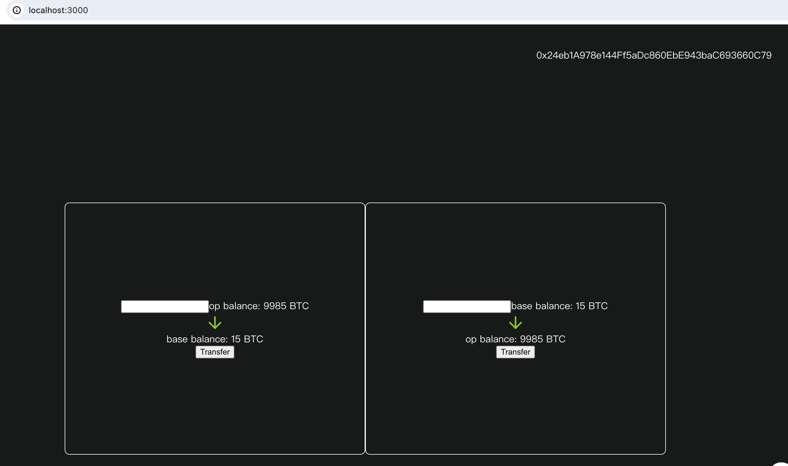

### Project title
A BTC token cross chain bridge between Sepolia-Optimism and Sepolia-Base

### Team members
- @caoshanhuyi

### Project Overview
I created a cross-chain bridge for BTC between Optimism and Base, which executes mint and burn operations during the cross-chain process to prevent double spending.

### Run-book
1. Install deps and start
```
npm install
```
```
npm run start
```
2. Import Metamask wallet & add Optimism and Base chain to Metamask (use blockscout), following mnemonic:
```
subway tray panda three indoor eyebrow grit sunset cannon trophy slush wealth
```
3. Metamask switch Op chain
4. Use Metamask add ERC-20 token(contract address: 0x249A61C6b439c0e5feE8164292D86Da6b5f6D809)
5. Use Metamask add a new account, it should be: 0x24eb1A978e144Ff5aDc860EbE943baC693660C79
6. Use Metamask transfer some token(ETH and BTC) to Account2, switch account2
7. Click 'Connect wallet' button, approve.
8. Enter your BTC amount you want to cross chain, then click 'Transfer' button, wait about 30s
9. Switch Base chain, then you can do the same operation
### Resources Used
- React
- bignumber.js
- web3.js
### Challenges Faced
My biggest challenges is I have no more time to write a beautiful UI
### What We Learned
Using IBC is a good idea for Ethereum ecosystem
### Future Improvements
In the future, I hope that the official can deploy Relayers in all chains of the Ethereum ecosystem so that I can deploy contracts in all chains, allowing a BTC to move across every chain in the Ethereum ecosystem.

### Proof
Optimism tx hash: https://optimism-sepolia.blockscout.com/tx/0x7991fb9c21a782cf8bdd1144a38dd2d7d4e8fd55632537d2ced8bd52b6ced16b?tab=index
Base tx hash: https://base-sepolia.blockscout.com/tx/0xf3ca2c904dcc657cf77ded8c2766c5eaa4dcec568d0c44f4c392024eb89777a7?tab=index


### PortAddress
Op: 0x5ac7f4653D582c56FE97D145c0C1c5B87FcA27f9
Base: 0x99CCfb7f7A41c917CA4243126B9AF34Ef9b1EacF
 

### Licence


